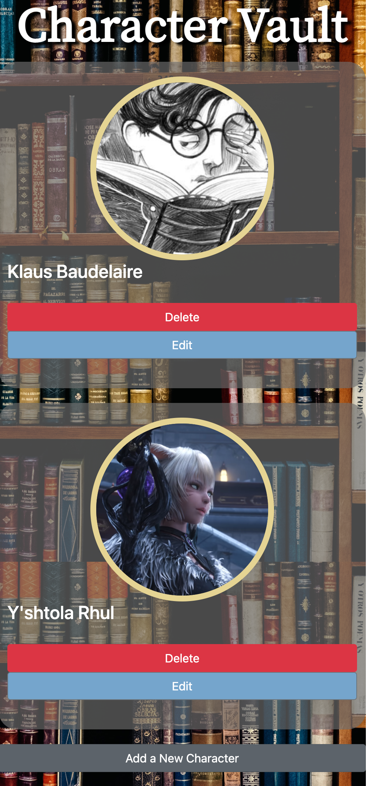
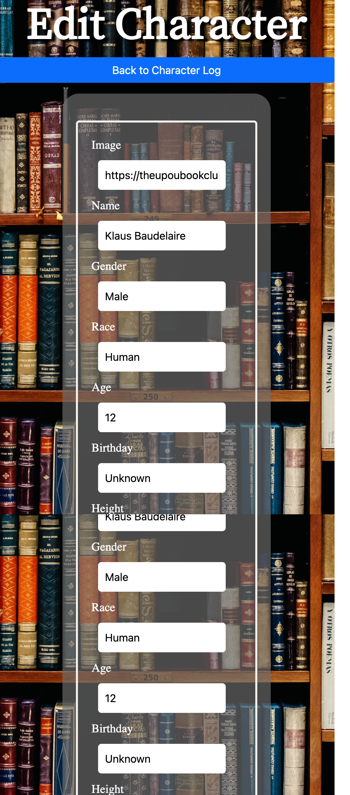
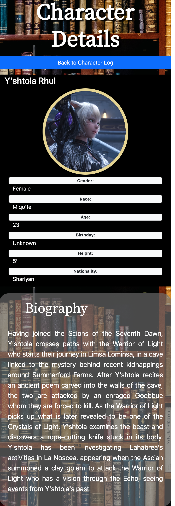

Character Vault
===============

A full-stack MERN application that allow users to create, edit, or delete detailed character profiles.

Technologies Used
===============
 - HTML5
 - CSS3
 - Javascript
 - Express
 - MongoDB
 - Mongoose

Screenshots
===============

Getting Started
===============
Here's the site
[link](https://rbucheli2.herokuapp.com/).

Future Enhancements
===============
- Implement basic authorization
- Allow users to add their own information
- Allow users to additional photos